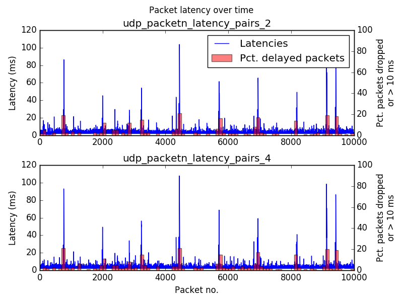
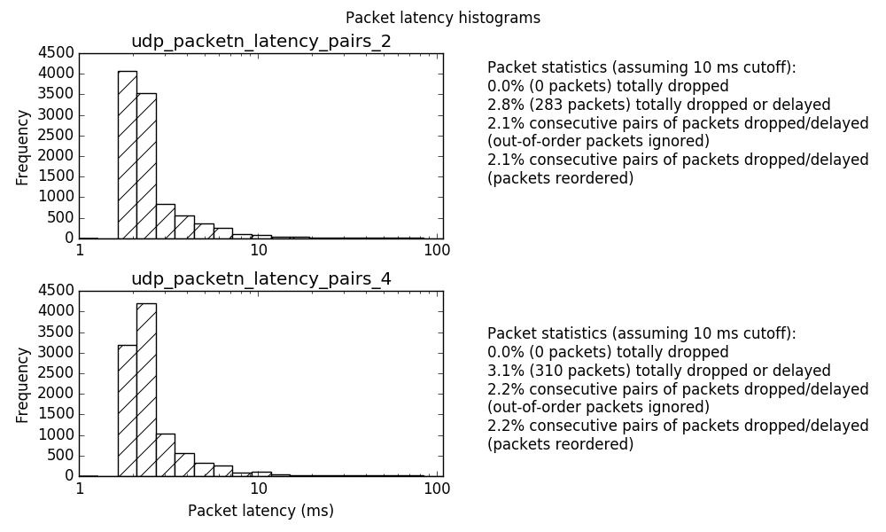

# ULTRA_PING

Hey you!

Do you want to characterise UDP packet latency on your network?

Are you sick and tired of boring old tools like `ping`?

Try new `ultra_ping`! You can:
* Measure the time it takes for UDP packets to get across your network

But...uhh...wait, there's more! You can also:
* See what happens at different data send rates!
* Try different packet sizes!
* Measure packet latency from multiple sending hosts simultaneously!
* Measure one-way latency (requires separate hardware timer sold separately
  as well as round-trip latency
* Save a list of latencies for each packet...TO A FILE!

What's that you say? Plain ol' `ping` does most of these things? Well...uhhh...

## No, but seriously

More seriously, this was written for a project involving a whole bunch of
Raspberry Pis sending real-time audio data to a phone, where we wanted to check
what the distribution of packet loss looked like. `ping` was an option, but
* a) **we weren't sure how comparable ICMP results would be to UDP**, and
* b) **we wanted to be able to measure one-way latency rather than round-trip latency**
  (in case there were nonlinearities which would lead to a difference other than
  just a factor of two in latencies).

## Usage

`ultraping` comes in two versions: `echo.py` (for round-trip tests) and
`quack.py` (for one-way tests - because everyone knows that quacks don't echo).
Both have the same usage: on one host you run the script in server mode, e.g.:

```
./echo.py --server
```

and on the other host you run the script in client mode:

```
./echo.py --client <IP address of server>
```

Once all packets have been received back (or a timeout has been reached because
some packets never made it), latencies are written to a file
`udp_packetn_latency_pairs`. The format of this file is:
* First line: total number of packets sent
* Remaining lines: packet number (in order of transmission) and latency for that
  packet number

Depending on whether you're running `echo.py` or `quack.py`, the behaviour is a
little different:
* In `echo` mode, the server just receives packets and sends them back to
  whatever client sent them, and latency measurement is done on the client. The
  packet latencies file therefore get written by the script on the client host.
  The server will stay alive until you kill it.
* In `quack` mode, latency measurement is done on the server, so packet
  latencies get written on the server host. The server will stay alive until
  all packets have been sent by the client.
  
More than one client can be run at a time with no problems. In `quack` mode,
make sure to start all the clients at the same time in order for the server to
count all clients as part of the same test. In this case, latencies will be saved
for each client separately as `udp_packetn_latency_pairs_<n>` where `<n>` is the ID
of each client as guessed from the client's hostname (see `guess_host_id()`).
  
To see all the different parameters you can tune (e.g. packet size/packet send rate), see `--help`.

## Latency Measurement

**Round-trip latency measurement** is pretty simple: the client records the
current system time in a packet, sends it off to the server, the server bounces
it back, and then the client calculates the latency based on the difference
between the new system time and the transmission time contained in the packet.

**One-way latency measurements** are a little more complicated, because they
require both the client and server to have access to a synchronised time source.
You *might* be able to do this by just synchronising the clocks on both hosts
with NTP (http://www.ntp.org/ntpfaq/NTP-s-algo.htm#Q-ACCURATE-CLOCK reckons you
should be able to get an accuracy of a few milliseconds with direct connections
between the two hosts), but we wanted to be surer of our measurements, so we
opted for a hardware timer accessible to both hosts. (In our case, this was a
counter on an FPGA (on a ValentF(x) LOGI Pi) connected to both hosts via SPI.
This actually didn't work too well for us in the end - there was some funny
analog thing going on that reduced Wi-Fi signal strength when we would connect
everything together. Maybe our cable just needed more grounding or something but
we didn't have time to investigate.) (If you also want to do something similar using
a LOGI Pi, you'll need the `logi` package from <https://github.com/fpga-logi/logi-tools>.)

## But wait, there's more!

OK, you have your file with a bunch of latencies. But aren't you itching to
do some *analysis* on all that data?

We've got you covered. Check out `analysis/latency_measurement_graphs.py`. This
script will plot you a timeseries of packet latencies with overlaid bars showing
what percentage of packets were delayed more than N milliseconds, and also a
histogram of packet latencies. Call it with one or more `udp_packetn_latency`
files; it'll plot you the data from all of them. For example:





## TODOs

* Write tests for the analysis code.
